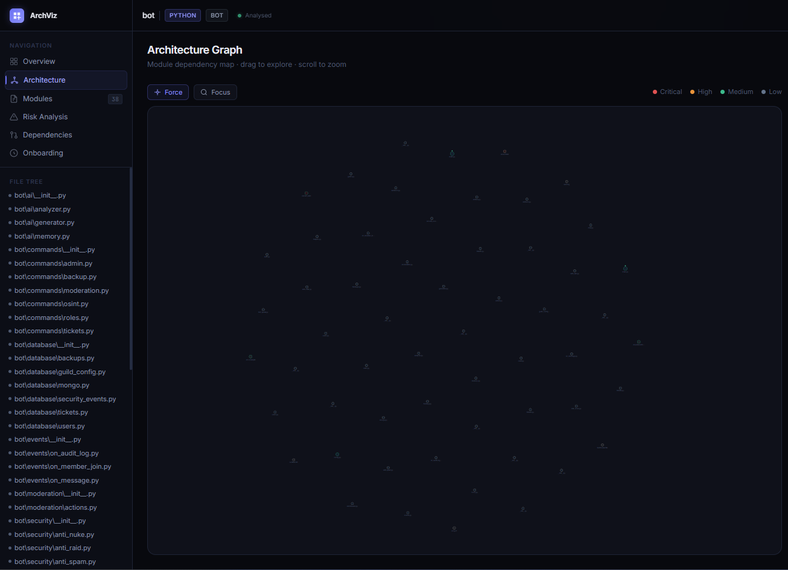
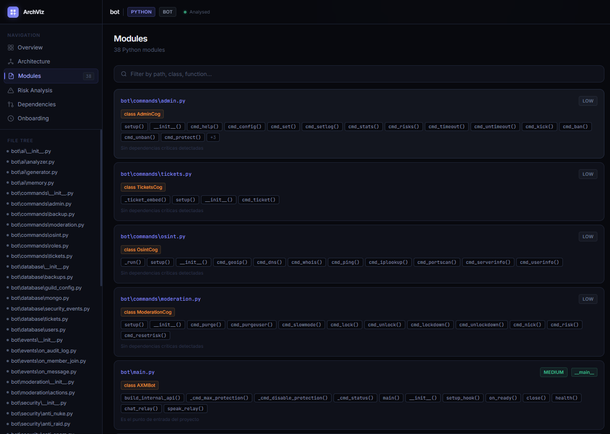
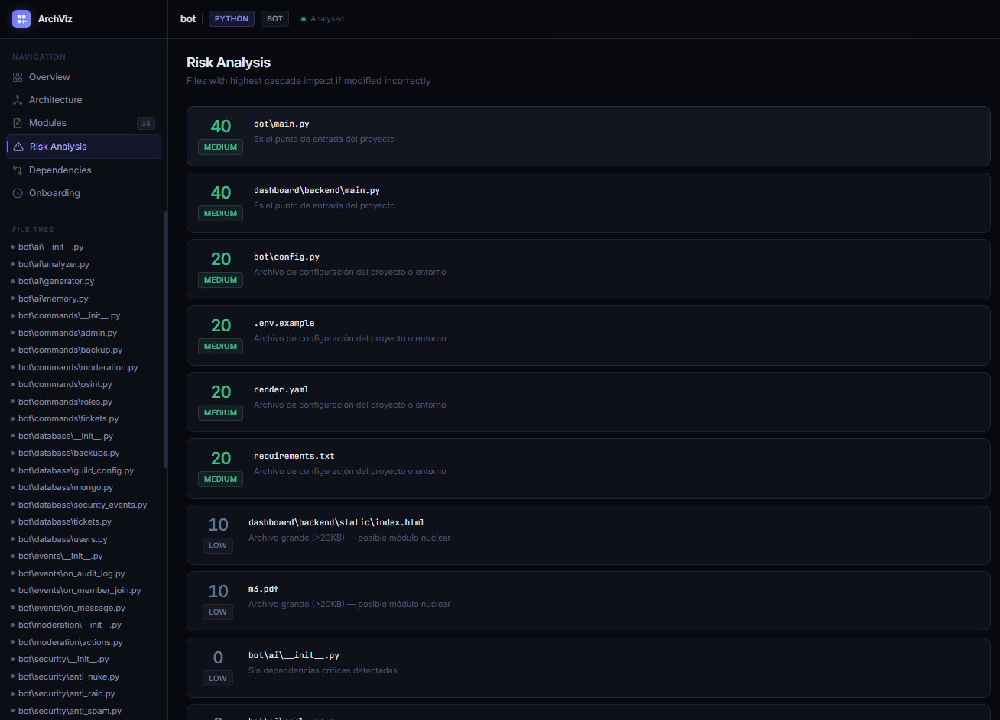
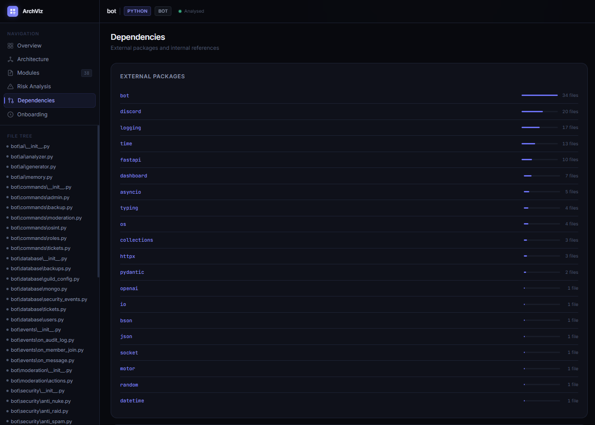

<div align="center">

# 🚀 Project Analyzer

### Advanced Software Architecture Intelligence Platform

Analyze • Visualize • Document • Understand


### Transform any codebase into a fully documented architecture in minutes.

</div>

---

<p align="center">
  
</p>

---

## 📚 Table of Contents

* [Overview](#-overview)
* [Features](#-features)
* [Screenshots](#-screenshots)
* [Installation](#-installation)
* [Usage](#-usage)
* [Architecture](#-architecture)
* [Supported Technologies](#-supported-technologies)
* [Project Structure](#-project-structure)
* [Output](#-output)
* [Use Cases](#-use-cases)
* [Roadmap](#-roadmap)
* [Changelog](#-changelog)
* [Contributing](#-contributing)
* [License](#-license)

---

# 🎯 Overview

Project Analyzer is an advanced software architecture intelligence platform that automatically analyzes source code, discovers technologies, maps dependencies, evaluates risks, and generates interactive documentation.

Designed for developers, teams, consultants, and open-source maintainers who need to understand complex codebases quickly.

### Key Benefits

* Reduce onboarding time
* Understand unfamiliar projects
* Visualize architecture
* Detect critical files
* Explore dependencies
* Generate documentation automatically
* Audit large codebases efficiently

---

# ✨ Features

### 🔍 Project Discovery

* Recursive project scanning
* File structure analysis
* Entry point detection
* Configuration discovery

### 🧠 Technology Detection

* Programming language detection
* Framework identification
* Database discovery
* Package manager recognition

### 🔗 Dependency Analysis

* Internal dependency mapping
* External package detection
* Dependency graph generation
* Relationship visualization

### ⚠️ Risk Assessment

* Critical file detection
* Impact analysis
* Dependency-based scoring
* Risk classification

### 📚 Documentation Generation

* Project summaries
* Architecture reports
* Dependency documentation
* Developer onboarding guides

### 🌐 Interactive Dashboard

* Architecture visualization
* Dependency exploration
* Risk heatmaps
* Technology overview
* Project statistics

---

# 📸 Screenshots

## Dashboard Overview

<p align="center">
  
</p>

## Architecture Visualization

<p align="center">
  
</p>

## Risk Analysis

<p align="center">
  
</p>

## Dependency Mapping

<p align="center">
  
</p>

## Project Intelligence

<p align="center">
  
</p>

---

# ⚡ Installation

Clone the repository:

```bash
git clone https://github.com/AXM-DEVs/project-analyzer.git
```

Navigate to the project:

```bash
cd project-analyzer
```

Install dependencies:

```bash
pip install -r requirements.txt
```

---

# 🚀 Usage

Analyze any local project by providing its path.

### Windows

```bash
project-analyzer analyze "C:\Projects\MyApplication"
```

### Linux

```bash
project-analyzer analyze "/home/user/my-app"
```

### Python Execution

```bash
python main.py analyze "/path/to/project"
```

---

# 🏗 Architecture

Project Analyzer follows a multi-stage analysis pipeline:

```text
Input Project
      │
      ▼
Reader Engine
      │
      ▼
Language Detection
      │
      ▼
Dependency Analysis
      │
      ▼
AST Parsing
      │
      ▼
Risk Assessment
      │
      ▼
Documentation Generation
      │
      ▼
Architecture Mapping
      │
      ▼
Interactive HTML Dashboard
```

---

# 🛠 Supported Technologies

## Languages

* Python
* JavaScript
* TypeScript

## Frameworks

* FastAPI
* Flask
* Django
* React
* Next.js
* Vue
* NestJS
* Express

## Databases

* PostgreSQL
* MongoDB
* SQLite
* Redis
* Firebase
* Supabase

---

# 📂 Project Structure

```text
project-analyzer/

├── analyzer/
│   ├── core.py
│   ├── reader.py
│   ├── dependency.py
│   ├── language.py
│   ├── risk.py
│   └── ast_parser.py
│
├── generator/
│   ├── documentation.py
│   ├── architecture.py
│   └── html_export.py
│
├── utils/
│   ├── logger.py
│   └── fs.py
│
├── templates/
│
├── docs/
│   └── images/
│
├── main.py
├── requirements.txt
├── setup.py
└── README.md
```

---

# 📊 Output

After analysis, Project Analyzer generates:

* Architecture maps
* Dependency graphs
* Technology summaries
* Risk reports
* Developer documentation
* Interactive HTML dashboards

Example:

```text
Files Scanned: 524

Directories: 67

Technologies:
- Python
- FastAPI
- PostgreSQL

Critical Files:
- main.py
- auth.py
- database.py

Dashboard Generated Successfully
```

---

# 🎯 Use Cases

### Developer Onboarding

Understand new projects faster.

### Architecture Reviews

Visualize software structures.

### Technical Audits

Identify critical components.

### Legacy Systems

Explore undocumented projects.

### Open Source Research

Analyze repositories before contributing.

### Internal Documentation

Generate architecture documentation automatically.

---

# 🗺 Roadmap

## v1.2.0

* AI-generated project summaries
* Mermaid export
* PDF reports
* Graph filtering
* Enhanced onboarding

## v1.3.0

* Multi-language analysis
* Team collaboration
* Cloud analysis

## v2.0.0

* Real-time architecture intelligence
* AI-assisted code understanding
* Enterprise reporting
* Architecture recommendations

---

# 📜 Changelog

## v1.1.0

* Improved dashboard experience
* Enhanced dependency analysis
* Better framework detection
* Improved architecture visualization
* Performance optimizations

## v1.0.0

* Initial release
* Project scanning
* Dependency graph generation
* Risk analysis
* Documentation export
* HTML dashboard generation

---

# 🤝 Contributing

Contributions are welcome.

```bash
git checkout -b feature/my-feature
git commit -m "Add amazing feature"
git push origin feature/my-feature
```

Then open a Pull Request.

---

# ⭐ Support

If you find this project useful:

* Star the repository
* Share it with other developers
* Report issues
* Suggest improvements

---

# 📄 License

This project is licensed under the MIT License.

---

<div align="center">

### Built with ❤️ by AXM-DEVs

#### Project Analyzer — Understand Any Codebase.

⭐ Star this repository if you find it useful.

</div>
